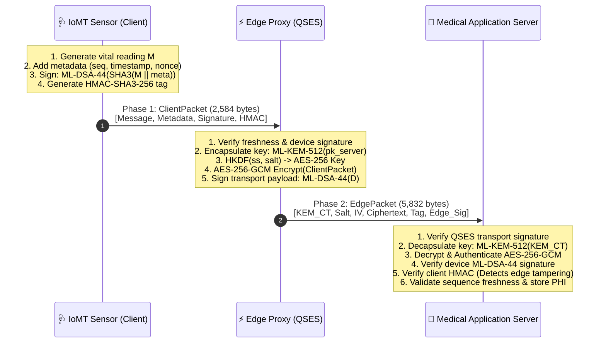

# Edge-Assisted Zero-Trust Post-Quantum Authentication Framework for Medical IoT (IoMT)

[](https://www.python.org/downloads/)
[](https://csrc.nist.gov/projects/post-quantum-cryptography)
[](LICENSE)
[]()

A reference implementation and benchmarking suite of the **Zero-Trust Post-Quantum Authentication Framework for Medical IoT (IoMT)**

---

## 📌 Table of Contents
- [Executive Overview](#-executive-overview)
- [Key Features & Innovations](#-key-features--innovations)
- [System Architecture](#-system-architecture)
- [Cryptographic Primitives](#-cryptographic-primitives)
- [Performance & Benchmark Metrics](#-performance--benchmark-metrics)
- [Repository Structure](#-repository-structure)
- [Getting Started](#-getting-started)
  - [Prerequisites](#prerequisites)
  - [Docker Setup (Recommended)](#docker-setup-recommended)
  - [Local Setup](#local-setup)
- [Running Tests & Benchmarks](#-running-tests--benchmarks)
- [Citation](#-citation)

---

## 🔬 Executive Overview

Emerging quantum computing advances (Shor's algorithm) render classical public-key cryptosystems (RSA, ECC) vulnerable to catastrophic compromise. While NIST has standardized Post-Quantum Cryptography (PQC), algorithms like **ML-KEM (CRYSTALS-Kyber)** and **ML-DSA (CRYSTALS-Dilithium)** impose heavy computational and energy burdens on battery-operated Medical IoT (IoMT) sensors (e.g., ECG, continuous glucose monitors, smart pacemakers).

Existing solutions either:
1. **Force full on-device PQC**: Drain sensor battery life with high latency (~8.2 ms) and excessive memory usage (>280 MB RAM).
2. **Rely on proxy decryption at the edge**: Break end-to-end encryption, expose plaintext patient health information (PHI) to edge servers, and violate HIPAA/GDPR zero-trust principles.

### The Solution:
This framework implements a **three-tier zero-trust edge-offloading architecture** that:
- Offloads heavy lattice key encapsulation (ML-KEM-512) and AES-256-GCM authenticated encryption to a **Quantum-Secure Edge Server (QSES)** without ever granting it access to plaintext medical data.
- Preserves **end-to-end device-generated digital signatures (ML-DSA-44)** for legal accountability and non-repudiation at the Medical Application Server.

---

## 🚀 Key Features & Innovations

* **Zero-Trust Edge Offloading**: The edge proxy (QSES) executes expensive lattice and symmetric cryptographic operations without plaintext exposure.
* **Dual-Layer Digital Signatures**: Retains the IoMT sensor's ML-DSA-44 signature through transport while attaching an edge transport signature to guarantee provenance and transport integrity.
* **Tamper & Replay Protection**: Dynamic sequence number validation, timestamp windows ($\Delta t$), multi-nonce tracking ($n_i, n_q, IV$), and client-side HMAC-SHA3-256 tags prevent replay and detect malicious edge behavior.
* **Formal Verification**: Verified in the Quantum Random Oracle Model (QROM) with EUF-CMA security reductions and formally proven using the **Scyther** tool (22/22 claims satisfied).

---

## 🏗️ System Architecture



---

## 🔐 Cryptographic Primitives

| Primitive | Standard / Parameter | NIST Security Level | Purpose in Protocol |
| :--- | :--- | :--- | :--- |
| **ML-DSA-44** | CRYSTALS-Dilithium2 | Level 2 (128-bit quantum) | Client & Edge digital signatures for non-repudiation |
| **ML-KEM-512** | CRYSTALS-Kyber512 | Level 1 (128-bit quantum) | Quantum-resistant session key establishment |
| **AES-256-GCM** | NIST SP 800-38D | Classical 256-bit | Authenticated symmetric encryption (12-byte IV, 16-byte Tag) |
| **HKDF** | RFC 5869 (SHA3-256) | High entropy | Uniform AES key derivation from Kyber shared secret |
| **SHA3-256 / HMAC** | FIPS 202 | 128-bit quantum collision | Zero-trust tamper detection & message integrity |

---

## 📊 Performance & Benchmark Metrics

Comparison between **Conventional Architecture (Full On-Device PQC)** vs. **Proposed Offloading Architecture (OA)**:

| Metric | On-Device PQC (PQCAIE) | Proposed Framework (OA) | Improvement / Reduction |
| :--- | :--- | :--- | :--- |
| **Client Computation Time** | 8.20 ms | **1.87 ms** | **77.2% Faster** ⚡ |
| **Client CPU Utilization** | 16.68% – 38.63% | **0.06% – 0.07%** | **99.6% Reduction** 📉 |
| **Client RAM Footprint** | 287.91 MB | **6.288 MB** | **97.8% Reduction** 💾 |
| **Client Energy Consumption**| 51.88 mJ | **21.96 mJ** | **57.7% Savings** 🔋 |
| **Context Switch Overhead** | 12.05 switches | **0.05 switches** | **99.6% Reduction** |
| **Total Protocol Latency** | ~10.5 ms | **4.20 ms** | **End-to-End Real-Time** |
| **Total Communication Cost** | 8,658 bytes | **8,416 bytes** | **Phase 1: 2584B, Phase 2: 5832B** |

> **Embedded Feasibility**: The 6.288 MB client memory footprint enables full deployment on standard low-power microcontrollers such as **ESP32-S3 (8 MB PSRAM)** and **ARM Cortex-M4/M33** platforms.

---

## 📁 Repository Structure

```text
pq-iomt-framework/
├── src/
│   ├── crypto/                 # Low-level cryptographic engines
│   │   ├── kem.py              # ML-KEM-512 encapsulation/decapsulation wrapper
│   │   ├── signature.py        # ML-DSA-44 signing and verification wrapper
│   │   ├── symmetric.py        # AES-256-GCM authenticated cipher engine
│   │   ├── hashing.py          # SHA3-256 and HMAC-SHA3-256 utilities
│   │   └── kdf.py              # HKDF-SHA3-256 key derivation
│   ├── entities/               # Three-tier zero-trust node implementations
│   │   ├── client.py           # IoMT Medical Sensor Client Node (Algorithm 1)
│   │   ├── qses.py             # Quantum-Secure Edge Server Node (Algorithm 2)
│   │   └── server.py           # Medical Application Server Node (Algorithm 3)
│   └── protocol/               # Packet serialization & error types
│       ├── messages.py         # ClientPacket & EdgePacket binary layouts
│       └── errors.py           # Protocol & MaliciousEdge exception definitions
├── oqs_Library_verification_scripts/ # Standalone PQC verification scripts
│   ├── test_kem.py             # KEM encapsulation validation
│   ├── test_signature.py       # ML-DSA signature validation
│   ├── test_tampering.py       # FO-transform implicit rejection demo
│   └── test_key_confirmation.py# Key confirmation protocol demo
├── tests/                      # Pytest automated test suite
│   └── test_symmetric.py       # Unit tests for cryptographic layers
├── Dockerfile                  # Container definition with liboqs-python
├── requirements.txt            # Python dependencies
├── pytest.ini                  # Pytest configuration
└── README.md                   # Project documentation
```

---

## 🛠️ Getting Started

### Prerequisites
- Docker (for full `liboqs` post-quantum support) **OR**
- Python 3.10+ with `liboqs-python` compiled locally.

---

### Docker Setup (Recommended)

Build and run within the preconfigured Open Quantum Safe container:

```bash
# 1. Build the Docker image
docker build -t pq-iomt-framework .

# 2. Run the test suite inside the container
docker run --rm -v $(pwd):/workspace -w /workspace pq-iomt-framework pytest -v -s
```

---

### Local Setup

```bash
# 1. Clone the repository
git clone https://github.com/Prashantbhati7/pq-iomt-framework.git
cd pq-iomt-framework

# 2. Create and activate virtual environment
python3 -m venv .venv
source .venv/bin/activate

# 3. Install dependencies
pip install -r requirements.txt
```

---

## 🧪 Running Tests & Benchmarks

Run the complete test suite:
```bash
# Run pytest with stdout enabled
pytest -s -v
```

Execute cryptographic library verification scripts:
```bash
python oqs_Library_verification_scripts/test_kem.py
python oqs_Library_verification_scripts/test_signature.py
python oqs_Library_verification_scripts/test_tampering.py
python oqs_Library_verification_scripts/test_key_confirmation.py
```

